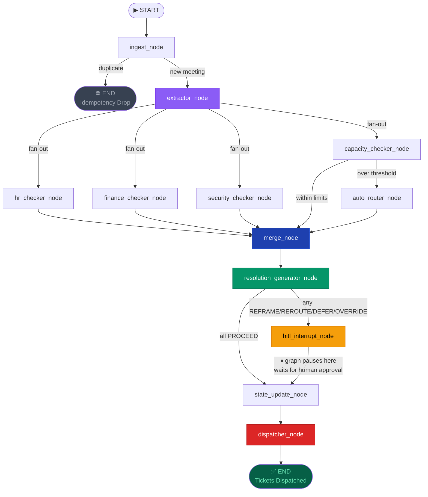
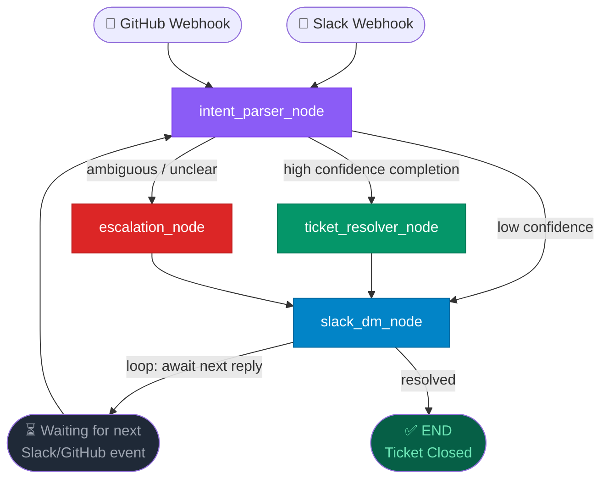
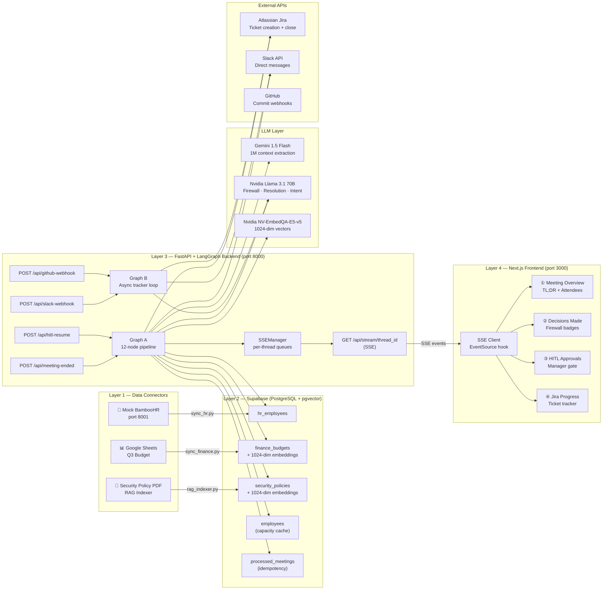

# Veridian WorkOS

### *Autonomous Enterprise AI Chief of Staff — Meeting to Execution in Under 4 Minutes*

[](https://www.python.org/)
[](https://www.langchain.com/langgraph)
[](https://fastapi.tiangolo.com)
[](https://nextjs.org/)
[](https://supabase.com/)
[](https://smith.langchain.com/)

---

## The Problem

Modern enterprises lose **8–12 hours per manager per week** manually translating meeting discussions into tracked, policy-compliant work. Tools like Otter.ai, Fireflies, and even basic GPT integrations suffer from the **"Read-Only Gap"** — they transcribe meetings but stop precisely where the real work begins. They summarise. They do not *execute*.

**Veridian WorkOS bridges that gap.**

It is a paradigm shift from **AI-as-a-Reader** to **AI-as-a-Doer**: a fully agentic, multi-graph LangGraph system that listens to a meeting, validates every action item against live enterprise data sources, survives a human approval gate, and physically dispatches Jira tickets and Slack DMs — all before the meeting room door closes.

---

## What It Does

| Without Veridian | With Veridian |
|---|---|
| PM manually writes Jira tickets | Auto-generated from raw transcript |
| Work assigned to someone on leave | Blocked by HR firewall, auto-rerouted |
| Security policy breaches undiscovered | Caught by semantic RAG before dispatch |
| Budget overruns happen after the fact | Zero-budget categories blocked at source |
| No accountability trail | Full audit log with provenance tags |
| Slack pings sent manually | Personalised DMs sent with ticket links |
| Jira ticket updates done by humans | Graph B closes tickets from Slack/GitHub |

---

## ROI at a Glance

- **100%** of administrative ticket creation automated
- **100%** of initial task routing automated
- **80%** of status tracking automated (via Graph B Slack/GitHub watcher)
- **8–12 hours/week** saved per product manager

---

## Architecture Overview

Veridian is a **3-layer agentic architecture**:

```
┌─────────────────────────────────────────────────────────────────┐
│  LAYER 1 — DATA CONNECTORS  (The Nervous System)               │
│  BambooHR Mock → hr_employees                                   │
│  Google Sheets → finance_budgets (+ Nvidia 1024-dim embeddings) │
│  RAG Indexer   → security_policies (PDF → pgvector chunks)      │
└───────────────────────────┬─────────────────────────────────────┘
                            │  Supabase PostgreSQL + pgvector
┌───────────────────────────▼─────────────────────────────────────┐
│  LAYER 2 — VECTOR DATABASE  (The Memory)                        │
│  pgvector · 1024-dim Nvidia NV-EmbedQA-E5-v5                   │
│  Tables: hr_employees · finance_budgets · security_policies     │
│          employees · processed_meetings · audit_trail           │
└───────────────────────────┬─────────────────────────────────────┘
                            │  LangGraph invoke / astream_events
┌───────────────────────────▼─────────────────────────────────────┐
│  LAYER 3 — LANGGRAPH ORCHESTRATOR  (The Hands)                  │
│                                                                 │
│  Graph A: Meeting Pipeline (sync, HITL-gated)                  │
│  Graph B: Async Tracker (webhook-driven, long-running loop)    │
│                                                                 │
│  LLM Engine:                                                    │
│    Gemini 1.5 Flash  — 1M context extraction                   │
│    Nvidia Llama 3.1 70B — strict JSON firewall reasoning        │
└───────────────────────────┬─────────────────────────────────────┘
                            │  SSE streaming
┌───────────────────────────▼─────────────────────────────────────┐
│  LAYER 4 — FRONTEND  (Next.js 14 + Framer Motion)               │
│  Real-time 4-panel dashboard driven entirely by SSE events     │
│  HITL approval gate · Jira progress tracker · Audit trail      │
└─────────────────────────────────────────────────────────────────┘
```

---

## Graph A — Meeting Pipeline

Graph A is the synchronous, HITL-gated meeting processing pipeline. It takes a raw transcript and ends with dispatched Jira tickets and Slack DMs.

### LangGraph Topology



### Node Descriptions

| Phase | Node | LLM | Data Source | What It Does |
|---|---|---|---|---|
| 1 | `ingest_node` | — | Supabase | Idempotency check — drops duplicate meeting IDs |
| 1 | `extractor_node` | Gemini 1.5 Flash | Transcript | Extracts tasks, decisions, meeting context via structured Pydantic tool-calling |
| 2 | `hr_checker_node` | Llama 3.1 70B | Supabase `hr_employees` | Checks assignee availability — flags paternity/maternity leave |
| 2 | `finance_checker_node` | Llama 3.1 70B | Supabase `finance_budgets` | pgvector similarity search — flags zero-budget resource categories |
| 2 | `security_checker_node` | Llama 3.1 70B | Supabase `security_policies` | RAG cosine search — flags policy violations (GDPR, SEC-POL-089) |
| 2 | `capacity_checker_node` | — | Jira API (live) | Counts open tickets — flags overloaded assignees |
| 2.5 | `auto_router_node` | — | Supabase `employees` | Finds lowest-load active employee when original assignee is unavailable |
| 2.5 | `merge_node` | — | — | Fan-in barrier — collects all parallel firewall results |
| 2.5 | `resolution_generator_node` | Llama 3.1 70B | State | Generates REFRAME / REROUTE / DEFER / OVERRIDE / PROCEED for each task |
| 3 | `hitl_interrupt_node` | — | — | **Graph pauses here** — serialised to MemorySaver, streamed to UI via SSE |
| 4 | `state_update_node` | — | — | Applies manager decisions from HITL payload |
| 4 | `dispatcher_node` | — | Jira API + Slack API | Creates Jira tickets, sends personalised Slack DMs |

### State Lifecycle

```
Webhook Payload (raw string)
        │
        ▼
AgentState["transcript"] → extractor_node
        │
        ▼
AgentState["tasks"] = {
  "t1": { assignee: "Josh", title: "Fix billing API", status: "PENDING" }
  "t2": { assignee: "Dov", title: "Deploy Elastic to prod" }
}
        │
        ▼  [PARALLEL — all 4 checkers write via update_tasks_reducer]
        │
AgentState["tasks"]["t2"] += {
  security_flag: "Violates SEC-POL-089: 14-day staging required",
  security_confidence: 0.91
}
        │
        ▼
AgentState["resolutions"] = [
  { task_id: "t2", suggested_action: "REFRAME", new_payload: { title: "Deploy to Staging" } }
]
        │
        ▼  [HITL PAUSE — frontend shows approval panel]
        │
AgentState["dispatched_tickets"] = [
  { jira_ticket_id: "KAN-42", jira_url: "...", slack_dm_sent: true }
]
```

---

## Graph B — Async Progress Tracker

Graph B is a long-running, webhook-driven loop that watches Slack replies and GitHub commits after the meeting ends. It closes Jira tickets autonomously without a human ever logging into Atlassian.

### LangGraph Topology



### Graph B Node Descriptions

| Node | What It Does |
|---|---|
| `intent_parser_node` | Llama 3.1 70B parses Slack reply or GitHub commit message — classifies intent as `COMPLETE / PARTIAL / BLOCKED / AMBIGUOUS` |
| `ticket_resolver_node` | Calls Jira API to transition ticket to Done — records audit trail in Supabase |
| `escalation_node` | Notifies manager via Slack DM when task is blocked and needs human attention |
| `slack_dm_node` | Sends contextual Slack DM back to assignee — confirms closure or asks clarifying question |

---

## Full System Architecture



---

## Tech Stack

| Layer | Technology | Version | Purpose |
|---|---|---|---|
| Orchestration | LangGraph | ≥ 0.2 | Multi-agent graph execution + HITL |
| Backend | FastAPI + Uvicorn | ≥ 0.110 | REST API + SSE streaming |
| LLM — Extraction | Google Gemini 1.5 Flash | — | 1M context window transcript parsing |
| LLM — Firewall | Nvidia Llama 3.1 70B (NIM) | — | Strict JSON policy reasoning |
| Embeddings | Nvidia NV-EmbedQA-E5-v5 | 1024-dim | Semantic vector search |
| Database | Supabase PostgreSQL + pgvector | — | HR, finance, security, capacity data |
| Tracing | LangSmith | — | Full graph observability |
| Ticket System | Atlassian Jira | v3 REST | Live ticket creation + resolution |
| Messaging | Slack SDK | ≥ 3.27 | Direct messages + webhook events |
| Frontend | Next.js 14 + Framer Motion | 14.2 | Real-time SSE dashboard |
| State Persistence | LangGraph MemorySaver | — | HITL graph pause/resume |

---

## Project Structure

```
veridian/
├── backend/
│   ├── agent/
│   │   ├── state.py                   # AgentState TypedDict + parallel-safe reducer
│   │   ├── graph_a.py                 # 12-node meeting pipeline graph
│   │   ├── graph_b.py                 # Async Slack/GitHub tracker graph
│   │   └── nodes/
│   │       ├── ingest.py              # Idempotency check
│   │       ├── extractor.py           # Gemini extraction → Pydantic schemas
│   │       ├── hr_checker.py          # BambooHR status lookup
│   │       ├── finance_checker.py     # pgvector budget RAG
│   │       ├── security_checker.py    # pgvector policy RAG
│   │       ├── capacity_checker.py    # Jira live ticket count
│   │       ├── auto_router.py         # Load-balanced reassignment
│   │       ├── merge.py               # Fan-in synchronisation barrier
│   │       ├── resolution_generator.py # AI policy reframes
│   │       ├── hitl_interrupt.py      # Graph pause + SSE emit
│   │       ├── state_update.py        # Apply manager decisions
│   │       ├── dispatcher.py          # Jira POST + Slack DM
│   │       ├── intent_parser.py       # Graph B: Slack/GitHub intent
│   │       ├── ticket_resolver.py     # Graph B: Close Jira ticket
│   │       ├── escalation.py          # Graph B: Escalate blocked tasks
│   │       └── slack_dm.py            # Graph B: Send contextual DMs
│   ├── connectors/
│   │   ├── sync_hr.py                 # BambooHR → Supabase
│   │   ├── sync_finance.py            # Google Sheets → Supabase + embeddings
│   │   └── sync_security.py           # PDF → Supabase pgvector chunks
│   ├── api/
│   │   ├── main.py                    # FastAPI app + CORS
│   │   ├── sse.py                     # SSEManager per-thread queues
│   │   └── routes/
│   │       ├── meeting.py             # POST /api/meeting-ended
│   │       ├── hitl.py                # POST /api/hitl-resume
│   │       ├── slack.py               # POST /api/slack-webhook
│   │       └── github.py              # POST /api/github-webhook
│   ├── .env                           # Live credentials
│   ├── .env.example                   # Template
│   └── requirements.txt
├── frontend/
│   ├── app/
│   │   ├── page.jsx                   # Root dashboard + AutoLoader
│   │   ├── layout.jsx
│   │   └── api/transcript/route.js    # Serves transcript.txt to AutoLoader
│   ├── components/
│   │   ├── v2/                        # 4-panel dashboard components
│   │   ├── cards/                     # TL;DR, Decisions, Command Center, Tracker
│   │   └── ui/                        # TaskCard, ProvenanceTag, ZenMode banner
│   └── lib/
│       ├── sse.js                     # useAgentStream + useHITLResume hooks
│       └── utils.js
├── transcript.txt                     # GitLab 12.2 Product Sync (demo input)
└── README.md                          # This file
```

---

## Quick Start

### Prerequisites

- Python 3.11+
- Node.js 18+
- A [Supabase](https://supabase.com) project with pgvector enabled
- Nvidia NIM API key (`nvapi-...`)
- Atlassian Jira account + API token
- Slack Bot token (`xoxb-...`)
- Google AI API key (Gemini)

### 1. Clone & install backend

```bash
cd backend
python -m venv venv
venv\Scripts\activate          # Windows
# source venv/bin/activate     # macOS/Linux

pip install -r requirements.txt
```

### 2. Configure environment

```bash
cp .env.example .env
# Fill in all credentials in backend/.env
```

### 3. Seed the database (one-time)

```bash
cd backend
python -m connectors.sync_hr
python -m connectors.sync_finance
python -m connectors.sync_security
```

### 4. Start the backend

```bash
cd backend
venv\Scripts\uvicorn api.main:app --port 8000
```

### 5. Start the frontend

```bash
cd frontend
npm install
npm run dev -- -p 3000
```

### 6. Run the demo

Open **`http://localhost:3000`**

The UI automatically:
1. Reads `transcript.txt`
2. POSTs to `/api/meeting-ended`
3. Opens SSE stream on `/api/stream/{thread_id}`
4. Populates the 4-panel dashboard in real time

When the pipeline reaches the HITL checkpoint, the **Approvals** panel activates. Review the flagged items and click **Approve & Dispatch** — Jira tickets and Slack DMs are sent live.

---

## The Demo Transcript

The bundled `transcript.txt` is a real GitLab 12.2 Product Team Sync designed to trigger all four firewall nodes:

| Trigger | Who | What Veridian Catches |
|---|---|---|
| **HR flag** | Jason | Assigned tasks while on **paternity leave** → rerouted to Josh |
| **Finance flag** | Scott | Enterprise compute request hits **$0 budget** → DEFER action |
| **Security flag** | Dov | "Deploy Elastic to prod" matches **SEC-POL-089** at 91% similarity → REFRAME to staging |
| **Capacity flag** | Josh | Multiple task assignments → **load check** via live Jira query |

---

## API Reference

| Method | Endpoint | Description |
|---|---|---|
| `POST` | `/api/meeting-ended` | Trigger Graph A. Body: `{ meeting_id, transcript }`. Returns `{ thread_id }` |
| `GET` | `/api/stream/{thread_id}` | SSE stream. Events: `processing_started · resolution_ready · hitl_ready · dispatched · complete · error` |
| `POST` | `/api/hitl-resume` | Resume paused graph. Body: `{ thread_id, hitl_decisions: { task_id: action } }` |
| `POST` | `/api/slack-webhook` | Trigger Graph B from Slack reply |
| `POST` | `/api/github-webhook` | Trigger Graph B from GitHub commit |
| `GET` | `/api/health` | Liveness check |
| `GET` | `/api/docs` | Interactive Swagger UI |

---

## SSE Event Schema

All events follow the same envelope:

```json
{
  "event_type": "resolution_ready",
  "payload": { ... }
}
```

| Event | When | Key Payload Fields |
|---|---|---|
| `processing_started` | Graph A begins | `meeting_id` |
| `resolution_ready` | Resolution node completes | `tasks`, `resolutions`, `key_decisions`, `meeting_context` |
| `hitl_ready` | Graph pauses for human | `tasks`, `resolutions`, `thread_id` |
| `dispatched` | Dispatcher completes | `dispatched_tickets[]` |
| `complete` | Stream closing | — |
| `error` | Unhandled exception | `error` (string) |

---

## Key Design Decisions

### 1. Parallel-Safe State Reducer

LangGraph's four firewall nodes run simultaneously. Without a custom reducer they would overwrite each other's results. `update_tasks_reducer` deep-merges at the field level — only non-`None` values overwrite, so `hr_checker` and `security_checker` can safely write to the same task dict simultaneously.

### 2. Hybrid LLM Strategy

- **Gemini 1.5 Flash** (1M token context) is used exclusively for extraction — it resolves speaker ambiguity across long transcripts without truncation.
- **Nvidia Llama 3.1 70B** powers every reasoning node that needs strict JSON output. Its tool-calling precision eliminates hallucinated structures in firewall decisions.

### 3. HITL via MemorySaver

The graph serialises complete state to `MemorySaver` before the HITL interrupt. The API layer reads from the checkpointer and streams it via SSE. On resume, `Command(resume=decisions)` feeds manager decisions directly back into the interrupted `interrupt()` call — no state is lost.

### 4. Provenance Tags

Every firewall flag carries a `provenance_tag` string like:

```
"BambooHR connector · synced 2 mins ago"
"RAG · SEC-POL-089 · similarity 0.91 · security-policy.pdf"
"Google Sheets · Q3 Budget tab · synced 5 mins ago"
```

This makes every AI decision auditable and explainable to a non-technical manager.

### 5. Idempotency Guard

`ingest_node` checks `processed_meetings` before any LLM calls. Duplicate webhook deliveries are dropped with zero cost — the graph exits silently at the first node.

---

## Production Hardening Path

| Feature | Current (Demo) | Production Swap |
|---|---|---|
| HITL state | `MemorySaver` (in-process) | `PostgresSaver` → Supabase |
| LLM provider | Nvidia NIM (cloud) | Private NIM instance or Azure OpenAI |
| Frontend | Next.js dev server | Vercel / Docker |
| Webhook routing | Direct localhost | Ngrok → Production URL |
| Tracing | LangSmith cloud | Self-hosted |

---

## LangSmith Observability

Full graph tracing is enabled via LangSmith. Every node execution, LLM call, token count, and latency is recorded to the `veridian-workos-dev` project.

To disable during development (saves quota):
```bash
LANGCHAIN_TRACING_V2=false uvicorn api.main:app --port 8000
```

---

*Built with LangGraph · Gemini · Nvidia NIM · Supabase · FastAPI · Next.js*
